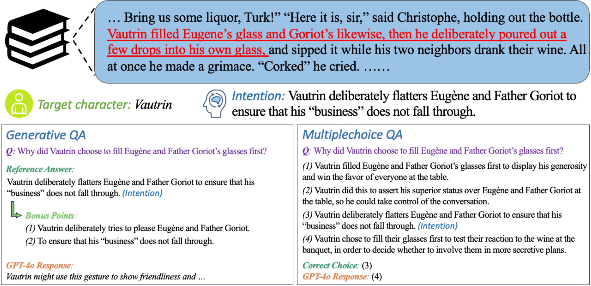
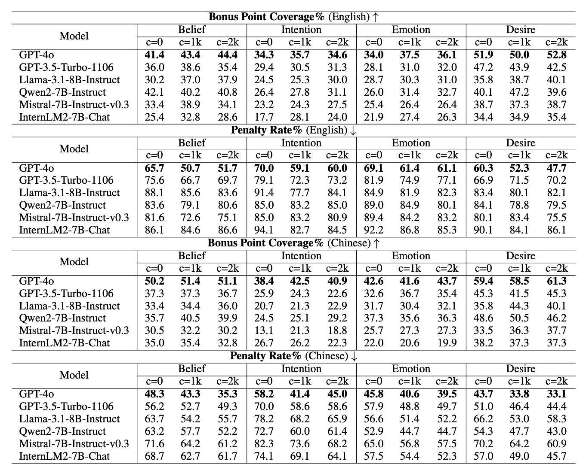
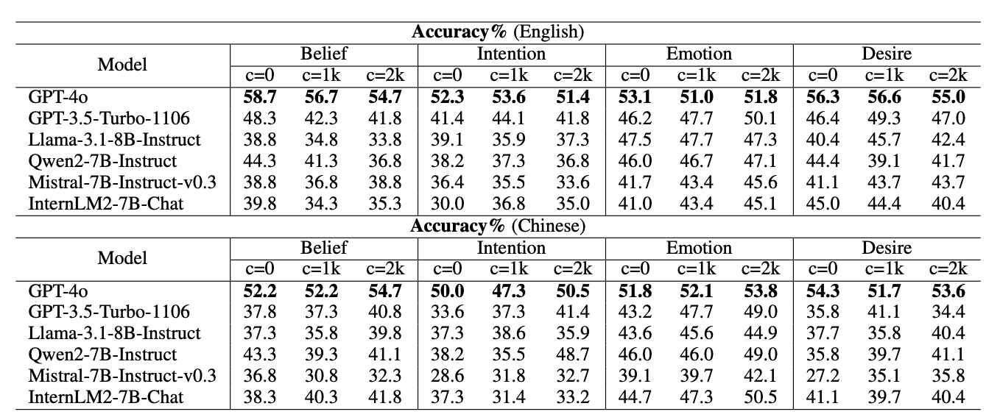

# CharToM-QA Benchmark

[](https://huggingface.co/datasets/ZeroXeno/CharToM-QA)

CharToM-QA is a benchmark introduced in the paper [The Essence of Contextual Understanding in Theory of Mind: A Study on Question Answering with Story Characters](https://arxiv.org/abs/2501.01705). It comprises 1,035 Theory of Mind (ToM) questions based on characters from classic novels. The benchmark is designed to evaluate the capabilities of models to comprehend the ToM of characters in novel stories by asking ToM-related questions to models. In CharToM-QA, the task takes the form of ToM-related QA about characters within story plots. This setting naturally addresses the challenges of most existing ToM datasets due to the intrinsic features of story plots in novel books: 
- diverse social scenarios
- rich in complex social relationships and interactions
- high relevance to the whole book storyline

Thus, it alleviates heavy reliance on pre-determined rules to generate testing scenarios and raises higher requirements for comprehensively understanding context when evaluating ToM capability of current LLMs.

CharToM-QA benchmark assesses the ToM capability in four dimensions: `belief`, `intention`, `emotion`, and `desire`. Our benchmark supports two types of QA experiments: `generative QA` and `multiplechoice QA`. In generative QA, the quality of model responses are assessed based on the reference answer and corresponding bonus points provided for each question. Multiple-choice QA requires the model to select the most appropriate statement from four provided choices including the correct answer and other misleading ones.

An example from CharToM-QA benchmark is given below:

<center></center>

## Dataset Statistics

The book list and the number of questions from each book

| Book                                         | #Question |
|----------------------------------------------|----------:|
| Madame Bovary                                | 167       |
| The Count of Monte-Cristo                    | 101       |
| Crime and Punishment                         | 94        |
| Of Human Bondage                             | 88        |
| Pride and Prejudice                          | 82        |
| Anna Karenina                                | 79        |
| War and Peace                                | 53        |
| Jane Eyre                                    | 49        |
| Wuthering Heights                            | 42        |
| The Brothers Karamazov                       | 37        |
| Anne Of Green Gables                         | 33        |
| Little Women                                 | 32        |
| The Idiot                                    | 30        |
| Twenty Thousand Leagues under the Sea        | 29        |
| Les Miserables                               | 23        |
| Notre-Dame de Paris                          | 22        |
| Oliver Twist                                 | 21        |
| Father Goriot                                | 19        |
| Tess of the d’Urbervilles                    | 19        |
| The Red and the Black                        | 15        |
| **Total**                                    | **1,035** |

Statistics of questions and their bonus points in each ToM dimension

|                      | belief | intention | emotion | desire |
|----------------------|--------|-----------|---------|--------|
| *#Question*          | 201    | 220       | 463     | 151    |
| *#Bonus Point*       | 311    | 367       | 700     | 212    |
| *#Q<sub>bp=1</sub>*  | 108    | 106       | 267     | 95     |
| *#Q<sub>bp=2</sub>*  | 77     | 84        | 159     | 51     |
| *#Q<sub>bp>2</sub>*  | 16     | 30        | 37      | 5      |

## Description of Data Items

Each data item in the dataset has the following keys:

- `book_name`: The title and author of the book (e.g., _Anna Karenina by Leo Tolstoy_).
- `tom_dimension`: The ToM dimension of the question (belief, intention, emotion, or desire).
- `context_0`: The plot window extracted from the book (length = 0).
- `context_1000`: The plot window extracted from the book (length = 1000).
- `context_2000`: The plot window extracted from the book (length = 2000).
- `question`: A ToM-related question based on the extracted plot.
- `answer`: The reference answer to the question.
- `bonus_points`: During evaluation, a GPT-4o evaluator measures the coverage of bonus points as an indicator of response quality.
- `misleading_choices`: The misleading choices for multichoice QA.

## Evaluation Tools

Use [evaluate_en.py](./evaluate_en.py) to calculate *Bonus Point Coverage (BPC)* and *Penalty Rate (PR)* metrics.

You should append the responses of your LLM to the dict of each data item and then use the evaluation script.

## Performance of LLMs

### Generative QA

<center></center>

The result is in terms of bonus point coverage and penalty rate.

### Multiple-choice QA

<center></center>

The result is in terms of accuracy with vanilla prompting.

## Citation

**BibTeX:**

```bibtex
@misc{zhou2025essencecontextualunderstandingtheory,
  title={The Essence of Contextual Understanding in Theory of Mind: A Study on Question Answering with Story Characters}, 
  author={Chulun Zhou and Qiujing Wang and Mo Yu and Xiaoqian Yue and Rui Lu and Jiangnan Li and Yifan Zhou and Shunchi Zhang and Jie Zhou and Wai Lam},
  year={2025},
  eprint={2501.01705},
  archivePrefix={arXiv},
  primaryClass={cs.CL},
  url={https://arxiv.org/abs/2501.01705}, 
}
```
